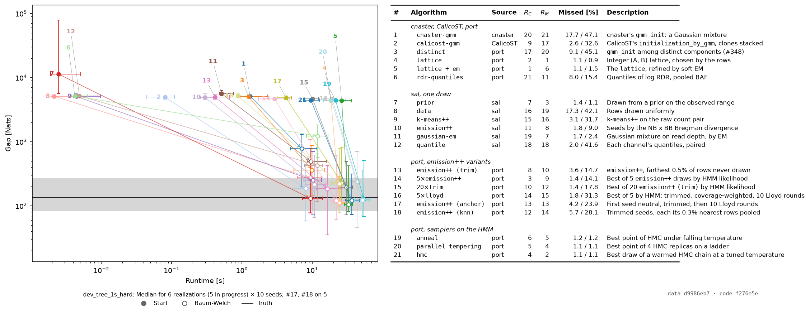

# Study: copy-state starts at known clones (#540)

**TL;DR:** on `dev_tree_1s_hard` at the planted clones (6 of 10 realizations × 10 seeds so far), six
starts end within 1.5% of rows missed after `--sal` Baum-Welch: `lattice` (0.9%), `prior`, parallel
tempering and `hmc` (1.1%), `anneal` (1.2%) and `lattice` + EM (1.5%). `cnaster`'s own `gmm_init` ends at
47.1%, CalicoST's at 32.6%, and every `emission++` variant at 9.0–31.3%. A start's own miss rate does not
predict the fit's: 5 × `emission++` starts at 1.4% and ends at 14.1%.

## Method

`python -m tests.studies.copy_state_stream sim/manifests/dev_tree_1s_hard.toml OUT --problems N --seeds 10 --held-out 3 --settings tests/studies/copy_sampler_settings.json`.

1. **Problem.** Each realization of `dev_tree_1s_hard` is drawn and pseudobulked at its planted clones
   (`port.sandbox.known_copy.problems`): 1 Mb bins under #551's 300 normal-UMI floor, phased allele
   reads, clones stacked along the genome, 7 states. About 7,700 rows per realization.
2. **Starts.** Every family in `port.extensions.copy_starts`, each as its own algorithm's output, with no
   `sal` mixture polish. A stochastic start runs 10 seeds.
3. **Polish.** `--sal` Baum-Welch: `port.patch.hmm_nophasing` with the per-clone shift (#276, #293), `sal`
   emission kernels, analytic gradients and the Rust lattice. Every score, a start's included, is on this
   objective: a start is decoded, shifted per clone, and rescored.
4. **Scored.** Gap: nats below the best log-likelihood any run reached on that realization. Missed: rows
   whose state is not the planted one under the best 1-1 matching of states. Both are reported at the
   start and after Baum-Welch. Truth is the planted states, polished by the same Baum-Welch.
5. **Tuning.** `anneal-hmm`, `tempering-hmm`, `hmc-hmm` and the `emission++` variants are tuned on 3
   held-out realizations that are never evaluated (`copy_sampler_settings.json`).

## Results: `dev_tree_1s_hard`, 6 realizations × 10 seeds (10 in progress)

Median gap below the best fit reached on each realization [nats], at the start and after Baum-Welch; median
rows missed; median seconds for start and Baum-Welch together. The planted states, polished, sit 135 nats
below the best (median).

| # | start | start gap | after BW | Missed start / after [%] | s |
| --- | --- | --- | --- | --- | --- |
| 4 | `lattice` | 4,384 | 112 | 1.1 / 0.9 | 34 |
| 5 | `lattice` + EM | 4,391 | 105 | 1.1 / 1.5 | 42 |
| 7 | `prior` | 11,372 | 130 | 1.4 / 1.1 | 11 |
| 20 | parallel tempering on the HMM | 4,421 | 123 | 1.1 / 1.1 | 25 |
| 21 | `hmc` on the HMM, warmed, T = 10 | 4,424 | 122 | 1.1 / 1.1 | 16 |
| 19 | `anneal` on the HMM | 4,415 | 127 | 1.2 / 1.2 | 28 |
| 11 | `gaussian-em` | 5,627 | 494 | 1.7 / 2.4 | 8 |
| 10 | `emission++` | 4,910 | 215 | 1.8 / 9.0 | 10 |
| 14 | 5 × `emission++` by HMM likelihood | 4,666 | 120 | 1.4 / 14.1 | 16 |
| 13 | `emission++`, trimmed | 4,986 | 185 | 3.6 / 14.7 | 13 |
| 6 | `rdr-quantiles` | 5,157 | 1,225 | 8.0 / 15.4 | 14 |
| 15 | 20 × trimmed `emission++` | 4,645 | 194 | 1.4 / 17.8 | 20 |
| 17 | `emission++`, neutral anchor (5 realizations) | 4,853 | 228 | 4.2 / 23.9 | 15 |
| 18 | `emission++`, kNN seeds (5 realizations) | 5,169 | 220 | 5.7 / 28.1 | 13 |
| 16 | 5 × Lloyd-refined `emission++` | 4,680 | 239 | 1.8 / 31.3 | 27 |
| 9 | `k-means++` | 5,087 | 250 | 3.1 / 31.7 | 10 |
| 2 | CalicoST `initialization_by_gmm` | 4,948 | 187 | 2.6 / 32.6 | 13 |
| 12 | `quantile` | 5,200 | 427 | 2.0 / 41.6 | 10 |
| 8 | `data` | 5,118 | 275 | 17.3 / 42.1 | 10 |
| 3 | `distinct` (#348) | 5,012 | 363 | 9.1 / 45.1 | 14 |
| 1 | `cnaster` `gmm_init` | 5,129 | 777 | 17.7 / 47.1 | 12 |

`gaussian-em` refuses on some seeds: a component's variance collapses on the normal clone's point mass, and
`sal` refuses rather than floor it. The figure is `tests.studies.copy_state_plot` over the merged stream,
stamped with its data hash and code commit.

## Defects found, and what was done about them

- **`cnaster`'s NB kernel scores probability 1 when `p` rounds to 1** (#560). Baum-Welch drove a state to
  `log mu = -43` and reported -23,359 nats against the planted -76,306. Patched in log space
  (`port.patch.hmm_nophasing.nb_logpmf`), pinned against scipy to 1e-9.
- **Beta-binomial precision at large tau** (#561) and **negative `emission++` divergences** (#562): the
  latter clamped at 0 for the study.
- **`sal`'s surrogate samplers sample a Gaussian mixture on raw counts and snap to observed rows** (#563).
  Replaced in the study by samplers on the HMM's own NLL (`port.sandbox.known_copy.hmm_samplers`).
- **The per-clone shift lets Baum-Welch split the neutral state** (#564): 42% missed from the truth start on
  one realization, at a 505-nat higher likelihood than the correct fit.

## Why good starts end badly

The HMM likelihood has higher-scoring wrong optima: an extra deep-loss state and a split neutral state
(#471, #564). A start's miss rate therefore does not predict the fit's: `lattice` starts at 1.0% missed
and ends at 59.3% on one screened realization.

## Upstream correspondence

`snakes_and_ladders` has no per-clone normalization and no copy-state HMM start. Expressing the problem
there would need a clone-indexed rate offset in its NB emission and a registry of HMM starts. The samplers
on the HMM's NLL would need `sal` to sample the HMM objective rather than its Gaussian surrogate (#563).
