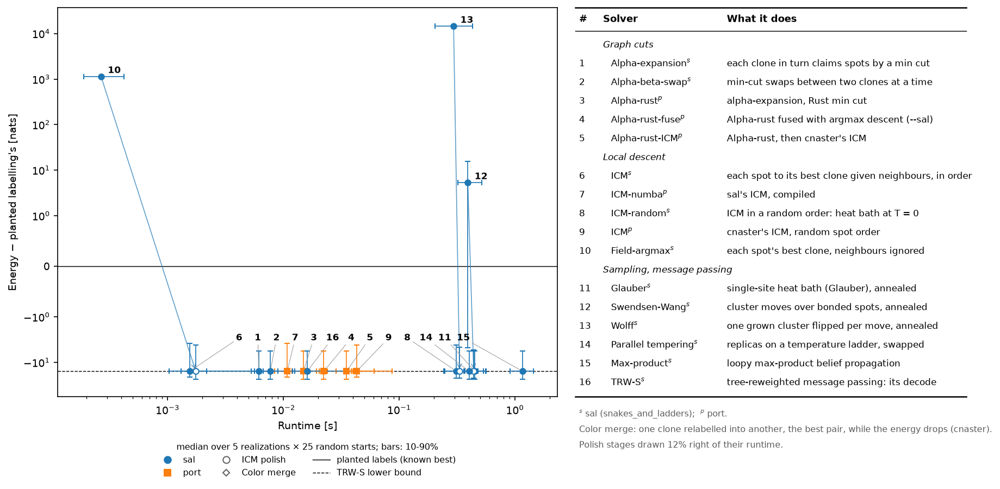
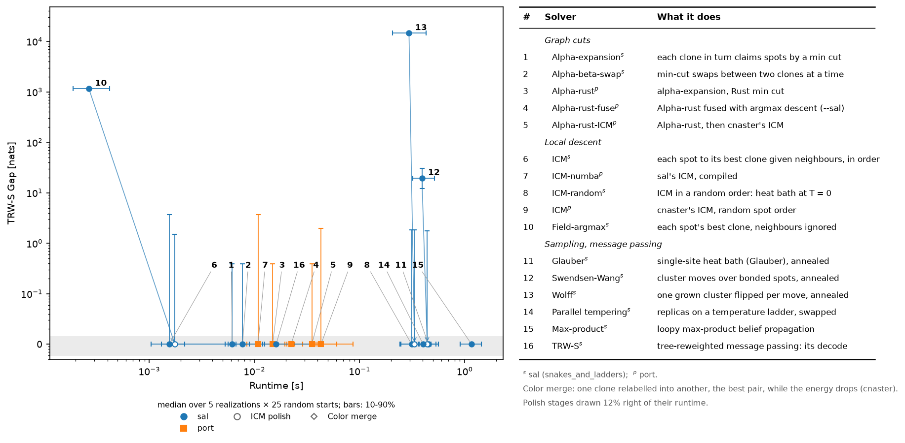
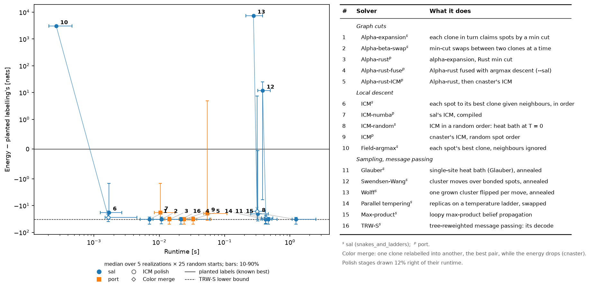
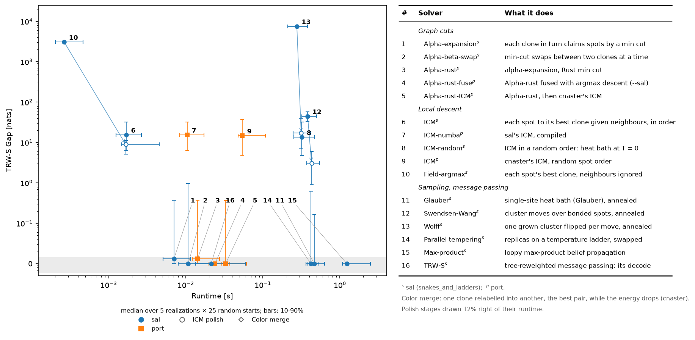
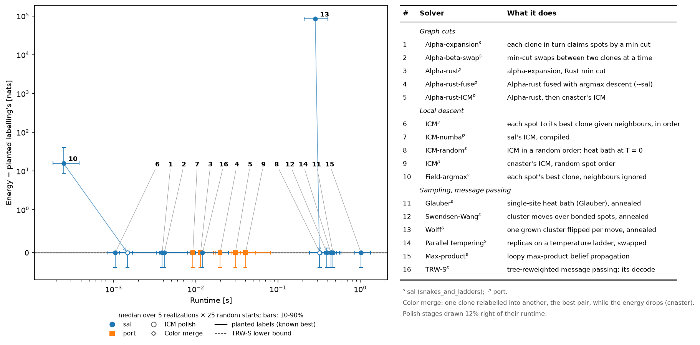
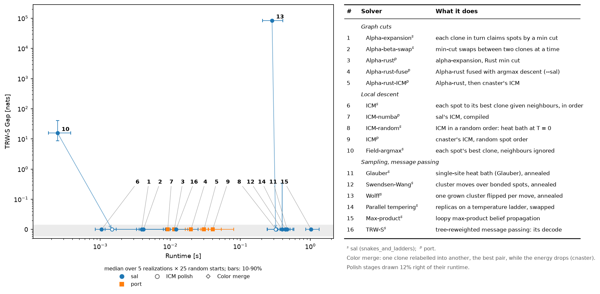
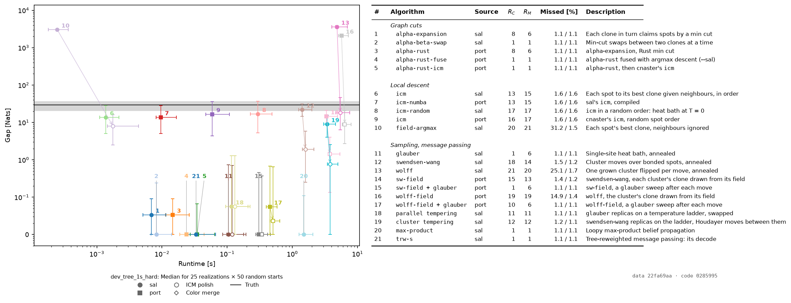

# Study: clone-field strength, dev_tree against CalicoST (#556)

**TL;DR:** at the planted clones, the pipeline's clone field is 10x stronger
on dev_tree than on CalicoST easy and hard: a median per-spot margin of
9.2–9.8 nats against 0.8 and 0.2. Field-argmax misassigns 2.5–2.9% of
dev_tree's spots against 36% and 44%. Depth, SNP coverage and BAF noise are
equal between them. The CNA mix and normal admixture carry the difference.
`sim/manifests/dev_tree_1s_{easy,hard}.toml` draw CalicoST's, and match its
known-law field to within 10% of the margin and 6% of the misassigned share.
On the hard analogue only TRW-S's decode, `--sal`'s Alpha-rust-fuse and
max-product reach TRW-S's bound on every run from random labels. ICM stops
13–15 nats above it, and neither polish moves it.

Fixtures: CalicoST easy (`23989aa4`) and hard (`1ae26365`), the shipped
samples. `dev_tree_1s` (`4687b541`), `dev_tree_1s_easy` (`d08e3a1b`) and
`dev_tree_1s_hard` (`d2938975`) are each manifest's r0 hash; realization k
is the k-th draw of `[sample] seed = 0`. This branch's `port.sim.draw` has no
`counts_sampler` key, so the manifests' `"urn"` is ignored and every draw
here is the gamma sampler's: the hashes are `docs/baseline-release.md`'s.

## Method

`python -m tests.studies.field_strength pipeline | known | calicost`,
`python -m tests.studies.potts_stream`, `python -m tests.studies.calicost_figures`.

- **Pipeline field.** `--sal --oracle-start`'s first BAF + RDR inference,
  captured (`tests.studies.clone_labels capture`) and rebuilt at the planted
  labels (`port.sandbox.clone_starts.problem.build`). β = 1, 6 neighbours.
- **Known-law field.** `port.sandbox.known_field`: each realization drawn
  in memory and scored under the draw's own law at its planted states.
  - Gene UMIs are Dirichlet-multinomial.
  - Haplotype-A reads are beta-binomial.
  - Only the labels are unknown.
- **Strength.** Three readings per field:
  - the median over spots of the planted clone's field less the best
    other's (the margin);
  - the share of spots whose argmax is not the planted clone;
  - that argmax's ARI against the planted labels.
- **Solvers.** 5 realizations × 25 random labellings per manifest, every
  solver of #541's harness but bifurcation, `alpha` and the deprecated
  floor merge, plus TRW-S's decode.
  - Each run is polished by sal's ICM, then by the color merge.
  - The color merge is `cnaster`'s `merge_assignment` rule in closed form.
  - 4 spawned workers; the graph is built outside the timer.

## Field strength

| | median margin [nats] | 10% margin | argmax wrong | ARI |
| --- | --- | --- | --- | --- |
| pipeline, CalicoST easy (`23989aa4`) | 0.8 | −2.1 | 0.360 | 0.271 |
| pipeline, CalicoST hard (`1ae26365`) | 0.2 | −1.8 | 0.445 | 0.181 |
| pipeline, `dev_tree_1s` r2–r4 (r0 `4687b541`) | 9.2–9.8 | 3.2–3.8 | 0.025–0.029 | 0.941–0.951 |
| known law, CalicoST easy (`23989aa4`) | 3.5 | −0.1 | 0.105 | 0.737 |
| known law, `dev_tree_1s_easy` r0–r2 (r0 `d08e3a1b`) | 3.8 | −0.1 | 0.105 | 0.726 |
| known law, CalicoST hard (`1ae26365`) | 1.0 | −1.1 | 0.296 | 0.371 |
| known law, `dev_tree_1s_hard` r0–r2 (r0 `d2938975`) | 0.9 | −1.4 | 0.312 | 0.342 |
| known law, `dev_tree_1s` r0–r2 (r0 `4687b541`) | 17.6 | 8.2 | 0.002 | 0.996 |

- **Equal across the three:**
  - UMI per spot: 2,972–2,996;
  - SNP reads per spot: 402–434, at 1.03 reads per covered SNP;
  - share of genome differing per clone pair: 3.8–6.1% on easy, 4.2–5.8% on
    dev_tree.
- **BAF carries dev_tree's field:** 16.6 of its 17.6 nats. Its RDR alone
  misassigns 49%, and CalicoST's RDR under port's law 33% (easy) and 54%
  (hard).

## What sets it, and the manifests' numbers

`python -m tests.studies.field_strength calicost` computes every number below
from CalicoST's planted truth. The manifests carry them.

| | easy | hard | dev_tree (before) | manifest key |
| --- | --- | --- | --- | --- |
| clone-events LOH / imbalanced / balanced | 0.56 / 0.33 / 0.11 | 0.70 / 0.26 / 0.04 | LOH-heavy, 30–89 Mb | `[cna] mode = "shared.unique"` (a rate key is #556's) |
| event length | 50 Mb | 10 Mb | exponential, mean 50 Mb, a 125 Mb founder | `[cna.length]` exponential, mean 5e7 / 1e7 |
| expected BAF margin to the nearest clone | 1.8–2.6 nats | 0.9–1.2 | 6.0–19.3 | follows the two above |
| tumour fraction pooled per clone | 0.835 / 0.870 / 0.910 | 0.875 / 0.865 / 0.880 | 1 | `normal_frac = 0.14`, `admixture = "cell"` |
| tumour fraction's spatial field | sd ≤ 0.02, per clone | sd 0.056, length 1.3 spots | none | a GRF key is #556's |
| BAF overdispersion ρ (normal; tumour at its fraction) | 0.013; 0.005–0.018 | 0.020; −0.004–0.007 | 0 | `bb_overdispersion = 0.01` |
| phase | written phased | written phased | switched at 52.8% of SNPs | `switch_errors = false` |
| log(tumour / normal) expression, copy-neutral genes | sd 1.315, corr 0.31 | sd 1.321, corr 0.31 | 0 | a `[model]` key is #556's |

- **Tumour fraction.** Each tumour spot's MLE over every SNP at its clone's
  planted (A, B), under the cell law.
  - The per-spot estimates' sd (0.166, 0.205) equals the read noise, so the
    field's sd is read off the covariance at lags ≥ 1 spot.
  - Easy's is flat to 19 spots: per-clone offsets, not a spatial field.
- **ρ.** The moment estimator, unbiased at the true share
  (`known_field.overdispersion`, pinned by a test). Its null sd is 0.009 on
  these read counts; the 8 groups pool to 0.009.
- **Expression.** CalicoST's tumour spots follow a gene program of their
  own. Their normal spots follow port's λ to sd 0.35, their tumour spots to
  1.78.
  - Under port's law RDR is as weak on CalicoST as dev_tree's is by
    construction, so the known-law match holds without an expression term.
  - Anything that fits RDR (#540's copy starts) still needs one; #556
    proposes it.

## Solvers on the matched problems

Gap above TRW-S's bound, median / 90th percentile over 5 realizations × 25
random labellings, the share of runs at the bound, then the median after
ICM and the color merge. Numbers are the table's in the figures.

| # | solver | `dev_tree_1s` | `_easy` | `_hard` | `_hard` polished | ms |
| --- | --- | --- | --- | --- | --- | --- |
| 16 | TRW-S decode | 0 / 0, 100% | 0 / 0, 100% | 0 / 0, 100% | 0 | 12–21 |
| 4 | Alpha-rust-fuse (`--sal`) | 0 / 0, 100% | 0 / 0, 100% | 0 / 0, 100% | 0 | 20–24 |
| 15 | Max-product | 0 / 0, 100% | 0 / 0, 100% | 0 / 0, 100% | 0 | 1,026–1,234 |
| 11, 14 | Glauber, parallel tempering | 0 / 0, 100% | 0 / 0, 100% | 0 / 0.2–0.6, 73–77% | 0 | 402–467 |
| 1, 2, 3, 5 | graph cuts | 0 / 0, 100% | 0 / 0.39, 80–89% | 0 / 0.4–1.0, 40–82% | 0 | 4–35 |
| 6, 7, 8, 9 | ICMs | 0 / 0, 100% | 0 / 1.8–3.7, 50–62% | 13.5–15.4 / 32–37, 0% | 13.5–15.4 | 1–54 (8: 313–325) |
| 12 | Swendsen-Wang | 0 / 0.34, 85% | 19.7 / 30, 0% | 44.6 / 58, 0% | 3.1 | 382–395 |
| 10 | Field-argmax | 15.7 / 41, 0% | 1,154 / 1,174, 0% | 3,067 / 3,071, 0% | 9.0 | 0.3 |
| 13 | Wolff | 84,225 / 89,532, 0% | 14,565 / 15,155, 0% | 7,513 / 7,940, 0% | 17.1 | 276–295 |

- **`dev_tree_1s` does not discriminate.** Its planted labels are TRW-S's
  optimum on 4 of 5 realizations (0.34 nats above it on the fifth). Every
  solver but Field-argmax and Wolff reaches it.
- **The matched problems do.** Their planted labels sit 5.7–23.2 (easy) and
  27.4–48.8 (hard) nats above the bound.
- **ICM stalls on hard; the polishes don't help.** The color merge moves
  nothing after ICM on hard (its median equals ICM's for every solver); on
  easy, ICM then the merge bring every solver to the bound.
- **`--sal`'s solver holds.** Alpha-rust-fuse reaches the bound on every
  run of all three, in 20–24 ms.

| | energy − planted labelling's | gap above TRW-S's bound |
| --- | --- | --- |
| `dev_tree_1s_easy` |  |  |
| `dev_tree_1s_hard` |  |  |
| `dev_tree_1s` |  |  |

## Tuned solvers on `dev_tree_1s_hard`, 25 realizations × 50 starts (#559)

`dev_tree_1s_hard` r3–r27 (r0 `d2938975`), tuned on r0–r2.

Every sampler at its setting tuned on 3 held-out realizations
(`tests/studies/potts_sampler_settings.json`); #559's field-weighted cluster
moves and `sal`'s cluster tempering joined the finished stream by
`potts_stream --only --merge`. Gap above TRW-S's bound, median / 90th
percentile over 25 × 50 runs, the share at the bound, the median after ICM and
the color merge, Missed raw / polished, and the median runtime.

| # | solver | gap | at bound | polished | Missed [%] | ms |
| --- | --- | --- | --- | --- | --- | --- |
| 21 | TRW-S decode | 0 / 0 | 100% | 0 | 1.1 / 1.1 | 26 |
| 4 | `alpha-rust-fuse` (`--sal`) | 0 / 0 | 92% | 0 | 1.1 / 1.1 | 27 |
| 11 | `glauber` | 0.01 / 0.7 | 49% | 0 | 1.1 / 1.1 | 104 |
| 15 | `sw-field` + `glauber` | 0.01 / 0.5 | 48% | 0 | 1.1 / 1.1 | 276 |
| 17 | `wolff-field` + `glauber` | 0.06 / 0.7 | 39% | 0.02 | 1.1 / 1.1 | 392 |
| 18 | parallel tempering | 0.06 / 1.3 | 38% | 0.06 | 1.1 / 1.1 | 99 |
| 19 | cluster tempering | 8.9 / 15.5 | 0% | 0.77 | 1.2 / 1.1 | 2,830 |
| 14 | `sw-field` | 14.5 / 21.2 | 0% | 1.42 | 1.4 / 1.2 | 3,102 |
| 12 | `swendsen-wang` | 22.0 / 30.9 | 0% | 1.92 | 1.5 / 1.2 | 1,365 |
| 6, 7 | ICM, sequential | 13.7 / 28.5 | 0% | 13.7 | 1.6 / 1.6 | 2–10 |
| 16 | `wolff-field` | 2,088 / 2,261 | 0% | 8.9 | 14.9 / 1.4 | 5,045 |
| 13 | `wolff` | 3,601 / 3,906 | 0% | 18.3 | 25.1 / 1.7 | 4,595 |

- **Drawing a cluster's label from its field weight is better than `sal`'s
  uniform proposal, and not enough alone.** Swendsen-Wang falls from 22.0 to
  14.5 nats and Wolff from 3,601 to 2,088; neither reaches the bound.
- **A Glauber sweep after each move reaches it, and the sweep does the work.**
  With it, both moves match annealed `glauber` alone (0.01–0.06 nats, 1.1%
  missed) at 2.7–3.8× its runtime. On this field the cluster move adds cost
  without closing gap.
- **Wolff's budget counts single clusters,** as `sal`'s does, so 4,000 steps
  relabel few spots in a field this strong.
- The two kernels keep the Boltzmann law exactly on a 4-site enumeration
  (`tests/test_known_field_cluster.py`).

## Findings beside the study

- **cnaster's merge scores half the boundary.** `cnaster.icm.merge_assignment`
  adds `boundary_gain[u, v]`, one direction of the u–v boundary, to a
  merge's gain. Its own cost counts both, so it scores a merge's spatial
  gain at half the energy the merge removes.
  - `tests/test_known_field.py` pins this as a `bug` test.
  - The color merge follows the energy.
- **CalicoST's figures.** `tests.studies.calicost_figures` stages CalicoST's
  samples as `port.sim` realizations and draws them.
  - The tree is derived from the profile.
  - No phase is recorded, so there is no phase figure.
  - Genes are reindexed to the baseline.
  - The genomic panel shows the tumour program as tumour-clone RDR near 0.3
    against port's λ.
