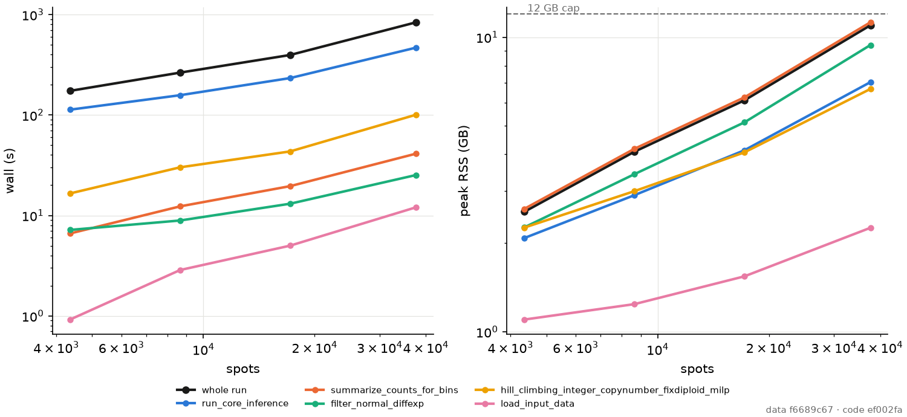

# Study: `--sal` from Visium scale to 35x, stage by stage (#569)

**TL;DR:** the largest rung `--sal` completes end to end on this 15 GB,
4-core host is **8.75x: 37,636 spots, 838 s, 10.98 GB peak**, clone ARI
0.9997 and copy ARI 0.9886, with `--lean-counts`. 17.5x (75,076 spots)
was killed at the 12.5 GB watchdog 6.2 min in, at the end of the BAF
stage, where 8.75x stood at 7.2 GB. The stop is `cnaster`'s driver holding
about eight dense `(n_bins, n_spots)` arrays at once; `n_bins` saturates at 3,789, so the
footprint is linear in spots at 0.27 MB per spot, and 100K and 35x project
to 28 and 42 GB. Fixed here: the dense loader matrices (peak −47% at 1x,
bitwise), int32 block and bin counts, the bin summary's int64 temporaries,
and the copy decode's float64 copies (−4.06 GB at 8.75x). Potts labelling
is not a limit: `--sal`'s row is within 1.9 nats of TRW-S's bound at every
rung to 600K spots, in 22 s.

## Method

`python -m tests.studies.scaling e2e | load | potts | resample | figure`;
each measurement one fresh process.

- **Draws.** `sim/manifests/scaling/`: one square slice per rung (#569's
  `[array] kind = "square"`), three stated hexagons of radius 0.18, the
  `dev_tree` model, the Pólya urn sampler (#549, merged from
  `claude/549-urn-sampler`), seed 0. Rungs are `n x n`: 66 (1x, 4,356
  spots), 93 (2x, 8,649), 131 (4x, 17,161), 194 (8.75x, 37,636), 274
  (17.5x, 75,076), 316 (100K, 99,856), 388 (35x, 150,544), 549 (70x) and
  775 (140x, 600,625). The draw is linear: 15.2 s and 1.05 GB at 4x, 71.9 s
  and 3.15 GB at 17.5x, so 140x would need about 25 GB to draw; its Potts
  problems use the manifest's layout alone.
- **End to end.** `tests.sim_audit`'s run of `run_cnaster_port --sal
  --no-plots`, with and without `--lean-counts`, scored on the planted
  truth. Every call the driver makes, and the HMRF substages under it, is
  timed and its RSS high-water sampled every 50 ms within the call.
- **Conditions.** Every run held a host-wide lock, so no other measured
  job ran beside it; one run per cell. `numba` kernels compile with
  `cache=True` from an on-disk cache warmed by earlier runs, so first calls
  are not compilation. Peak is RSS, entry is RSS when a stage opened, rise
  is its own increment. The 12 GB cap is the ticket's; a watchdog kills a
  run past 12.5 GB.
- **Gate vs stress.** 1x is the gate size and validates; the ratios below
  are read at 4x and 8.75x.

## End to end

| rung | spots | flags | wall s | peak GB | clone ARI | copy ARI | `n_obs` |
| --- | ---: | --- | ---: | ---: | ---: | ---: | ---: |
| 1x | 4,356 | `--sal` | 184.4 | 4.84 | 0.9991 | 0.9757 | 2,690 |
| 1x | 4,356 | `--sal --lean-counts` | 174.0 | 2.55 | 0.9991 | 0.9757 | 2,690 |
| 2x | 8,649 | `--sal` | 327.8 | 8.66 | 0.9996 | 0.9815 | 3,779 |
| 2x | 8,649 | `--sal --lean-counts` | 264.4 | 4.08 | 0.9996 | 0.9815 | 3,779 |
| 4x | 17,161 | `--sal --lean-counts` | 396.1 | 6.10 | 0.9994 | 0.9823 | 3,789 |
| 8.75x | 37,636 | `--sal --lean-counts` | 838.1 | 10.98 | 0.9997 | 0.9886 | 3,789 |
| 17.5x | 75,076 | `--sal --lean-counts` | killed at 372 | 12.54 | -- | -- | 3,787 |
| hex 1x | 4,356 | `--sal --lean-counts` | failed at 57 | 2.61 | -- | -- | 2,697 |

The 1x lean run's 26 output tables and arrays are bitwise the 1x dense
run's. Without `--lean-counts` 2x already peaks at 8.66 GB, and its slope
(4.84 GB to 8.66 GB per doubling) crosses 12 GB before 4x; 4x with the
sparse loader alone peaked at 8.18 GB.

**The hex control fails, and not on scale.** On the 66 x 66 hex draw the
read-depth stage's HMM start (`--sal`'s `kmeans++x5+em`, #489) raised in
`sal`'s beta-binomial M-step: `identifiable_concentration_bound` refuses
a mixture component whose weighted trials are 1.03, under its floor of 2
(`sal/emissions/mstep.py:515`). Its BAF stage passed, and every square
rung that fit in memory passed the read-depth stage. It is a defect of the start on a degenerate component, for a
ticket of its own; the square ladder does not depend on it.

**The bins saturate.** `create_bin_ranges` cuts the genome where a bin's
counts, summed over every spot, pass absolute thresholds
(`secondary_min_snp_umi = 200`). More spots make finer bins until each is
one block: 2,690 at 1x, 3,779 at 2x, then 3,789 from 4x on. Past 4x every
`(n_bins, n_spots)` array grows with spots alone.

## Stage by stage

Wall in s and peak in GB per rung under `--sal --lean-counts`, and the
log-log exponent of wall over 1x-8.75x (least squares, 4 rungs; code
ef002fa).

| stage | 1x | 2x | 4x | 8.75x | exponent |
| --- | --- | --- | --- | --- | ---: |
| whole run | 174.0 / 2.55 | 264.4 / 4.08 | 396.1 / 6.10 | 838.1 / 10.98 | 0.72 |
| `load_input_data` | 0.9 / 1.10 | 2.9 / 1.24 | 5.0 / 1.54 | 12.1 / 2.25 | 1.16 |
| adjacency (`lattice_multislice_adjacency`) | 0.0 / 1.60 | 0.0 / 1.92 | 0.1 / 2.52 | 0.1 / 3.77 | 1.02 |
| `summarize_counts_for_blocks` | 1.3 / 1.27 | 4.9 / 1.61 | 7.7 / 2.13 | 22.4 / 3.36 | 1.25 |
| `summarize_counts_for_bins` (2 calls) | 6.6 / 2.61 | 12.3 / 4.18 | 19.6 / 6.25 | 41.3 / 11.23 | 0.83 |
| `filter_normal_diffexp` | 7.2 / 2.26 | 8.9 / 3.43 | 13.1 / 5.14 | 25.3 / 9.40 | 0.59 |
| `run_core_inference` (2 calls) | 113.0 / 2.08 | 157.5 / 2.91 | 233.3 / 4.13 | 469.0 / 7.04 | 0.65 |
| -- pseudobulk merges | 2.1 / 2.07 | 7.8 / 2.90 | 18.0 / 4.06 | 35.4 / 6.91 | 1.30 |
| -- Baum-Welch | 24.8 / 2.08 | 15.0 / 2.91 | 23.0 / 4.07 | 83.6 / 6.89 | 0.59 |
| -- per-spot field | 0.7 / 1.85 | 1.6 / 2.63 | 3.8 / 3.85 | 7.7 / 6.70 | 1.11 |
| -- Potts (`alpha-rust-fuse-merge`) | 0.4 / 2.08 | 0.9 / 2.78 | 2.5 / 3.85 | 9.5 / 6.78 | 1.43 |
| integer copies (`hill_climbing_..._milp`) | 16.6 / 2.26 | 30.2 / 3.00 | 43.4 / 4.06 | 100.8 / 6.67 | 0.81 |
| `plot_clones_genomic` (built, not written) | 9.4 / 2.39 | 14.9 / 2.92 | 23.2 / 4.00 | 38.2 / 6.85 | 0.65 |

No stage approaches 30 minutes: the slowest, `run_core_inference`, is
469 s at 8.75x. One run per cell on a shared host: Baum-Welch reads 24.8 s
at 1x and 15.0 s at 2x, so an exponent below 1.2 is not a claim of
sublinear cost. Peak RSS grows as spots^0.83 (above a 0.9 GB interpreter
floor); the peak stage from 2x up is the second bin summary, where the
driver's arrays meet its outputs.

- **Load and adjacency.** The adjacency is `port`'s sparse swap at every
  rung (`port.patch.spatial.lattice_multislice_adjacency`, read from the
  bound name), 0.1 s at 8.75x. Isolated, 5 loads per process
  (`load`), warm repetitions 2-5:

  | rung | loader | load s | peak GB | allele + count matrices GB |
  | --- | --- | ---: | ---: | ---: |
  | 1x | dense | 1.3-2.5 | 2.37 | 1.28 |
  | 1x | `sparse_counts` | 0.9-1.6 | 1.08 | 0.06 |
  | 4x | dense | 12.5-20.3 | 6.45 | 5.02 |
  | 4x | `sparse_counts` | 3.8-4.4 | 1.55 | 0.23 |
  | 35x | `sparse_counts` | 40.4-44.7 | 6.22 | 1.99 |

  At 4x the sparse loader is 3.3x faster (median 4.3 s against 14.5 s) and
  4.2x lighter; the adjacency is 137,288 edges, 8 per spot, in 0.05 s. At
  35x (150,544 spots) the loader alone peaks at 6.22 GB, three times what
  it returns: the next wall after the driver's arrays. The adjacency there
  is 1,204,352 edges in 0.5 s.
- **Per-spot field.** `spot_clone_field` is `O(n_obs n_spots n_clones)` and
  allocates only its `(n_spots, n_clones)` output: 7.7 s over 6 calls at
  8.75x. Its integer check was 7.6 s over 4 calls at 2x; fixed below.
- **Potts labelling.** Not a limit. On captured problems and on fields
  resampled to each rung (each spot takes a captured spot's row of the same
  planted clone; `resample`; the 4- and 6-clone fields are the 2x run's
  first BAF and first read-depth calls), `--sal`'s `alpha-rust-fuse-merge`
  is within 1.9 nats of TRW-S's lower bound at every rung to 600,625 spots,
  in 22.1 s at most and 2.97 GB. Alpha expansion alone misses by 24,240
  nats at 600,625 spots and 6 clones; `cnaster`'s ICM ends 79 to 154,227
  nats above. Seconds / gap in nats, one run each:

| spots | clones | ICM s / gap | fuse-merge s / gap | alpha-rust s / gap | TRW-S s |
| ---: | ---: | --- | --- | --- | ---: |
| 4,356 | 4 | 0.18 / 78.7 | 0.46 / 0.0 | 0.05 / 0.0 | 0.08 |
| 4,356 | 6 | 0.20 / 1,093.4 | 0.47 / 0.0 | 0.04 / 0.0 | 0.08 |
| 8,649 | 4 | 0.27 / 253.4 | 0.56 / 0.0 | 0.13 / 0.0 | 0.33 |
| 8,649 | 6 | 0.33 / 2,360.6 | 0.51 / 0.0 | 0.07 / 0.0 | 0.10 |
| 17,161 | 4 | 0.49 / 173.8 | 0.92 / 0.0 | 0.21 / 0.0 | 0.46 |
| 17,161 | 6 | 0.61 / 4,431.6 | 0.71 / 0.0 | 0.18 / 0.0 | 0.20 |
| 37,636 | 4 | 0.87 / 237.3 | 1.21 / 0.0 | 0.38 / 0.0 | 1.60 |
| 37,636 | 6 | 1.17 / 9,419.3 | 1.08 / 0.0 | 0.35 / 0.0 | 0.61 |
| 150,544 | 4 | 3.94 / 889.7 | 4.79 / 0.0 | 1.93 / 0.3 | 6.99 |
| 150,544 | 6 | 4.53 / 37,582.7 | 5.13 / 0.0 | 1.37 / 0.0 | 1.96 |
| 600,625 | 4 | 14.68 / 4,266.9 | 17.53 / 1.9 | 6.81 / 17.3 | 22.39 |
| 600,625 | 6 | 19.06 / 154,227.0 | 22.06 / 0.0 | 6.12 / 24,239.5 | 11.49 |

  A checkerboard Glauber/ICM was not built: the graph cut is optimal and
  linear, so no schedule could improve on it.
- **Pseudobulk and Baum-Welch.** The merges read every spot and grow as
  spots^1.30, 2.1 s to 35.4 s; Baum-Welch runs on `(n_bins, n_clones)`
  pseudobulks, 12 calls at 1x and 14 at 8.75x, and was 83.6 s there. **The wall is
  `--sal`'s HMM start**: `kmeans++x5+em` ran 592 EM fits for 104 s of a
  283 s run at 2x (cProfile), inside `run_core_inference` (469 s of 838 s
  at 8.75x).

## Leaks

5 repetitions in one process, RSS after each with the result released:
the loader at 4x, dense 0.887, 0.945, 0.950, 0.949, 0.951 GB
and sparse 0.877, 0.935, 0.935, 0.935, 0.935 GB; `--sal`'s Potts row at
8.75x 0.716, 0.727, 0.741, 0.743, 0.747 GB. The first repetition adds
6.5 per cent, once -- imports and caches -- and none after it adds more
than 1.9 per cent: no leak by the ticket's 5 per cent rule, and no
`tracemalloc` hunt was needed. The field and pseudobulk stages were not
repeated in isolation: their inputs are the driver's.

## Fixes

Each is `patch`-tested bitwise against the code it replaces at the gate
size; the e2e outputs at 1x are bitwise the dense run's.

| fix | where | evidence |
| --- | --- | --- |
| `--lean-counts`: the loader's counts, `exp_counts` (`NamedCounts`) and allele matrices sparse through `filter_normal_diffexp` | `port.patch.io`, `port.patch.normal_spot` | alone: 1x peak 4.84 → 2.82 GB, 2x 8.66 → 4.87 GB (under cProfile); loader at 4x 3.3x faster; the allele matrices were spots × 13,482 int64, 32 GB at 35x |
| `--lean-counts`: `single_X`, `single_total_bb_RD` as int32 | `port.patch.omics.blocks` | 4x 8.18 → 6.79 GB |
| bin and block sums written into their outputs, bins in column blocks | `port.patch.omics.blocks` | isolated at 8.75x shapes: 3.99 → 2.86 GB, 27.2 → 6.8 s |
| the copy decode's capture holds the fit's arrays, not float64 copies | `port.extensions.copy_errors` | integer copy stage at 8.75x: 10.73 → 6.67 GB |
| the field's integer check in one compiled pass | `port.patch.hmrf.tabulated_field` | 231.5 → 32.5 ms at 3,779 × 8,649 (7.1x); 294 MB → 0 temporaries |

Two attempts were reverted on their own evidence. Summing the capture per
clone at capture time took the read-depth assignment before the floor merge
changed it, and copy ARI fell 0.9815 → 0.3693 at 2x (f1f30e6). Column
blocks alone on int64 counts were −9 per cent memory and 39 per cent slower
(d569dab); with int32 counts they pay.

## What stops the climb

At 8.75x the peak is the second `summarize_counts_for_bins` call: it
enters at 9.15 GB and adds its 2.08 GB of outputs. The 9.15 GB is the
driver's: `run_cnaster` holds `single_X`, `single_base_nb_mean` and
`single_total_bb_RD` before and after the normal-spot filter,
`copy_single_X_rdr` and `copy_single_base_nb_mean` (`run_cnaster.py:555`),
each `(3,789, n_spots)`, about eight such arrays at 1.14 GB (float64) or
0.57 GB (int32) each. `port` replaces functions, not the driver's
locals, so these cannot be released here. Linear at 0.27 MB per spot from
8.75x: 100K spots 28 GB, 35x 42 GB, 140x 163 GB.

**Upstream correspondence.** The change is `cnaster`'s: carry the per-spot
counts as `(n_spots, n_bins)` CSR -- a spot's 400 SNP reads fill at most
11 per cent of 3,789 bins in the two allele channels -- and form
pseudobulks by sparse products, which is how `snakes_and_ladders`'
emissions already consume counts (per-clone sums, never a dense spots × bins matrix). `sal` would
not need to change; its solvers scale (above). Until then the bins could
be capped by configuration (`secondary_min_snp_umi` proportional to spots),
which keeps memory at 1x's 2,690 bins but changes the segmentation: a
modelling choice, not made here.

## Reproduce

```
python -m port.sim.draw sim/manifests/scaling/sq_8p75x.toml --into DIR
python -m tests.studies.scaling e2e DIR/sq_8p75x/r0 -- --sal --no-plots --lean-counts
python -m tests.studies.scaling figure docs/plots/studies/scaling.png \
    --records docs/plots/studies/scaling_records.log
```


